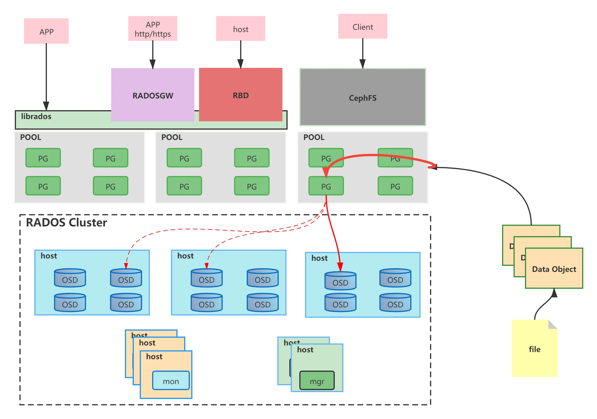
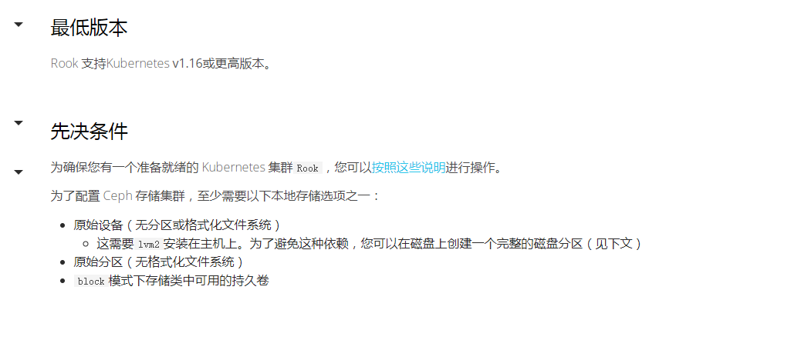
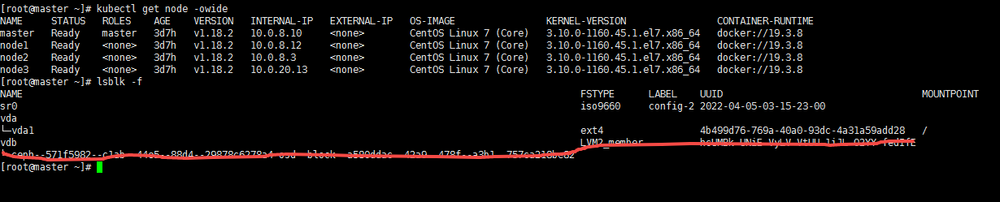

# 一、基础概念
## 1.基本介绍
* `Ceph uniquely delivers object, block, and file storage in one unified system.` Ceph是目前非常流行的**统一存储系统**，所谓统一存储系统，就是通过Ceph集群同时提供块**设备存储**、**对象存储**以及**文件系统服务**
  
## 2.Object: 
* `Object`是Ceph最底层的存储单元，大小可以自己定义通常为2M或4M,每个Object都包含了在集群范围内唯一的标识OID、二进制数据、以及由一组键值对组成的元数据。
## 3.POOL
* `POOL`是Ceph中的一些object的逻辑分组,Pool由若干个PG组成，其属性包括：所有者和访问权限、Object副本数目、**PG数目和CRUSH规则集合**等,Ceph中的Pool有两种类型
## 4.OSD
* `OSD`全称Object Storage Device，也就是负责响应客户端请求返回具体数据的进程。一个Ceph集群一般都有很多个OSD。
## 5.PG
* `PG`全称Placement Grouops，归置组，是一个逻辑的概念，一个PG包含多个OSD。引入PG这一层其实是为了更好的分配数据和定位数据
## 6.Monitor
* 一个Ceph集群需要多个`Monitor`组成的小集群，它们通过Paxos同步数据，用来保存OSD的元数据。也可是单个，但会有单点故障
## 7.RADOS
* `RADOS`全称Reliable Autonomic Distributed Object Store，是Ceph集群的精华，用户实现 数据分配、Failover等集群操作。
## 8.Libradio
* `Libradio`是Rados提供库，因为RADOS是协议很难直接访问，因此上层的RBD、RGW和CephFS都是通过librados访问的，目前提供PHP、Ruby、Java、Python、C和C++支持。
## 9.CRUSH
* `CRUSH`是Ceph使用的数据分布算法，类似一致性哈希，让数据分配到预期的地方。
## 10.RBD
* `RBD`全称RADOS block device，是Ceph对外提供的块设备服务。
## 11.RGW
* `RGW`全称RADOS gateway，是Ceph对外提供的对象存储服务，接口与S3和Swift兼容。
## 12.CephFS
* `CephFS`全称Ceph File System，是Ceph对外提供的文件系统服务。
## 13.MDS
* `MDS`: 全称Ceph Metadata Server，是CephFS服务依赖的元数据服务。
***
# 二、安装
## 1.环境准备
***

* 采用rook部署ceph集群前置条件 k8s 1.16+  至少一个节点有裸磁盘或裸分区或volumeMode=block的存储卷
* [rook官方文档](https://rook.io/)
***
 
* k8s集群采用一主三从 每一个节点都有一个vdb裸盘(一个节点可以有多个，也可以没有，至少保证一块裸盘)，红色部分是已经部署成功才有的状态
* 采用rook部署默认的ceph集群会默认自动发现所有节点的裸盘，与vdb名字无关，也可修改下面的yaml资源文件发现固定名称的裸盘
* 会在每一个节点启动一个osd的pod,master节点有污点无法调度,可以删除污点或修改下面的yaml支持osd污点容忍
***
## 2.安装
```shell
git clone --single-branch --branch v1.5.5 https://github.com/rook/rook.git #无法访问通过代理网站下载  git clone --single-branch --branch v1.5.5 https://hub.fastgit.xyz/rook/rook.git
kubectl apply -f rook/cluster/examples/kubernetes/ceph/common.yaml
kubectl apply -f rook/cluster/examples/kubernetes/ceph/crds.yaml
kubectl apply -f rook/cluster/examples/kubernetes/ceph/operator.yaml
kubectl apply -f rook/cluster/examples/kubernetes/ceph/cluster.yaml
```
## 3.检查ceph集群状态
* 通过 `kubectl get pod -n rook-ceph -owide` 发现部分pod镜像拉取失败（在`rook/cluster/examples/kubernetes/ceph/operator.yaml`）
* 更改`operator.yaml`的镜像名中为阿里云的镜像名可解决，这里使用另一种方法,从阿里云下载镜像再改名为google的镜像名
* 下面是镜像拉取脚本,需要在每一个节点执行
```shell
#! /bin/bash 

 image_list=(
	csi-node-driver-registrar:v2.0.1
	csi-attacher:v3.0.0
	csi-snapshotter:v3.0.0
	csi-resizer:v1.0.0
	csi-provisioner:v2.0.0
)
aliyuncs="registry.aliyuncs.com/it00021hot"
google_gcr="k8s.gcr.io/sig-storage"
for image in ${image_list[*]}
do
	docker pull $aliyuncs/$image
	docker tag  $aliyuncs/$image $google_gcr/$image
	docker rm   $aliyuncs/$image
	echo "$aliyuncs/$image $google_gcr/$image downloaded."
done
```
## 4.宿主机安装命令行工具
* `kubectl apply -f rook/cluster/examples/kubernetes/ceph/toolbox.yaml` 部署客户端pod,进入该容器可执行`ceph -s`查询ceph集群状态
* 将容器中`/etc/ceph/ceph.conf` `/etc/ceph/keyring` 复制到宿主机相同目录下,配置信息也可应该可从前面部署的yaml文件中找
* 在宿主机安装命令行工具,先设置yum源
```shell
tee /etc/yum.repos.d/ceph.repo <<-'EOF'
[Ceph]
name=Ceph packages for $basearch
baseurl=http://mirrors.163.com/ceph/rpm-jewel/el7/$basearch
enabled=1
gpgcheck=0
type=rpm-md
gpgkey=https://mirrors.163.com/ceph/keys/release.asc
priority=1
[Ceph-noarch]
name=Ceph noarch packages
baseurl=http://mirrors.163.com/ceph/rpm-jewel/el7/noarch
enabled=1
gpgcheck=0
type=rpm-md
gpgkey=https://mirrors.163.com/ceph/keys/release.asc
priority=1
[ceph-source]
name=Ceph source packages
baseurl=http://mirrors.163.com/ceph/rpm-jewel/el7/SRPMS
enabled=1
gpgcheck=0
type=rpm-md
gpgkey=https://mirrors.163.com/ceph/keys/release.asc
priority=1
EOF
```
* `yum -y install ceph-common` 安装成功后执行`ceph -s`查看ceph集群状态
***
# 三、命令
## 1.`ceph osd pool create <pool_name> <pg_name> <pgp_name>`
* 